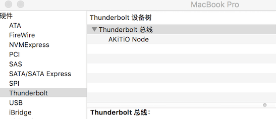

最近矿难，显卡价格回落不少，于是就心动买了个乞丐版的耕升1060显卡，给我的macbook加下武装。

### 材料
1. 显卡: 耕升1060 6G 追风版
2. 转接盒: akitio node
3. 雷电2/雷电3口双向转换器 (TB3->TB2 adapter)
4. 雷电2传输线一条
5. 早年的19寸三星显示器一台
> 以上总花费大约在3500RMB

### 细节说明

#### 组装连接设备
1. 打开akitio node，将显卡装入盒子中

2. 装好盒子，将 TB3->TB2 adapter 的雷电3公头插入 node，雷电2传输线连接 macbook pro 和转接头
3. akitio node 盒子插上电源、显示器，大功告成。

#### mac os下
* 我用系统版本为当前最新的稳定版10.12.6，早期版本可能雷电2/3适配器会出现问题。
* 苹果官方将在秋季正式推出的 10.13 版本中给予外接显卡原生的支持，不过目前的beta版中，只能识别如RX580等A卡。
* 目前所有版本的mac os系统均不能原生支持外置的N卡，需要使用一个国外大神的脚本（ automate-eGPU.sh: https://github.com/goalque/automate-eGPU.git ）破解。
##### 安装流程
1. macbook 连上 akitio 后，打开电源，应该就能在“系统报告”中识别到 akitio node 设备。(如果显示"unsupport"字样，可能是系统版本或者akitio node固件版本问题，因为之前苹果封禁了akitio node的设备，这个问题可以通过升级系统、升级akitio固件或者执行破解借本解决)

2. 关闭苹果的系统完整性保护()