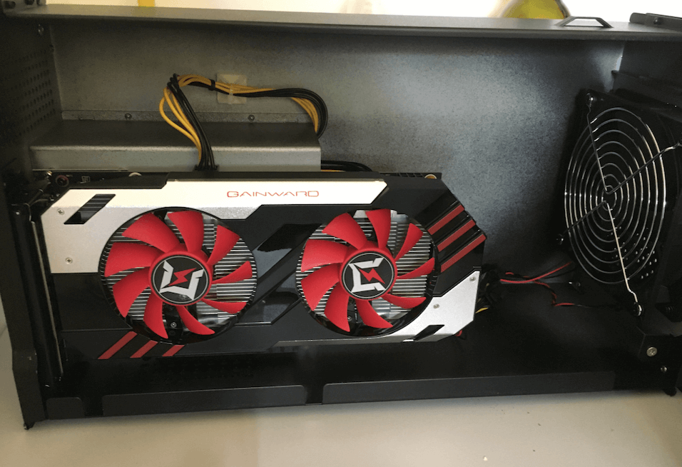
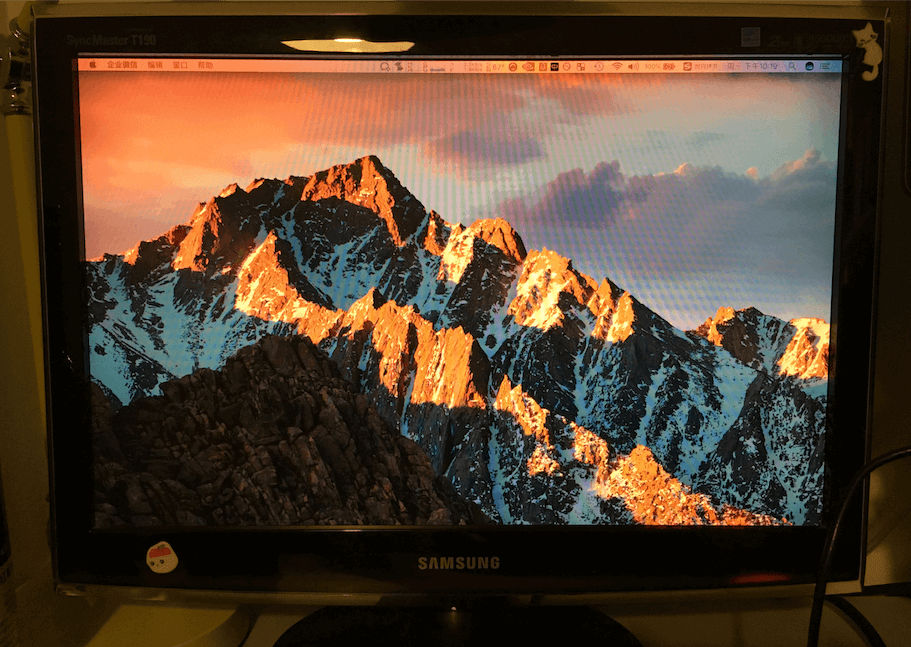
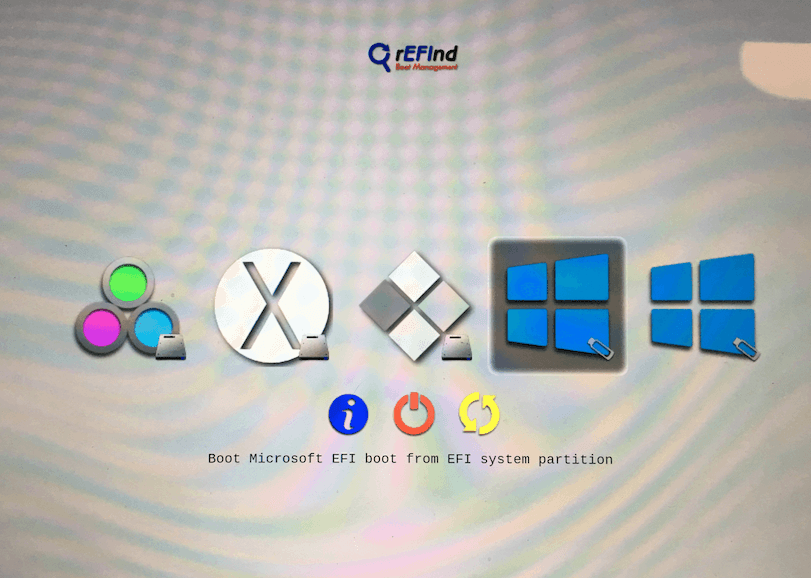
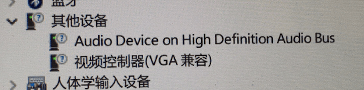
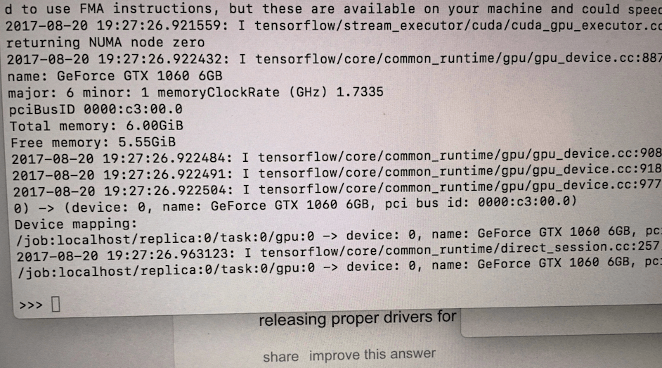

最近矿难，显卡价格回落不少，于是就心动买了个乞丐版的耕升1060显卡，给我的macbook加下武装。

## 材料
1. 显卡: 耕升1060 6G 追风版
2. 转接盒: akitio node
3. 雷电2/雷电3口双向转换器 (TB3->TB2 adapter)
4. 雷电2传输线一条
5. 早年的19寸三星显示器一台
> 以上总花费大约在3500RMB

## 细节说明

### 组装连接设备
1. 打开akitio node，将显卡装入盒子中

2. 装好盒子，将 TB3->TB2 adapter 的雷电3公头插入 node，雷电2传输线连接 macbook pro 和转接头
3. akitio node 盒子插上电源、显示器，大功告成。

### mac os下
* 我用系统版本为当前最新的稳定版10.12.6，早期版本可能雷电2/3适配器会出现问题。
* 苹果官方将在秋季正式推出的 10.13 版本中给予外接显卡原生的支持，不过目前的beta版中，只能识别如RX580等A卡。
* 目前所有版本的mac os系统均不能原生支持外置的N卡，需要使用一个国外大神的脚本（[automate-eGPU.sh]( https://github.com/goalque/automate-eGPU.git)）破解。
#### 安装流程
1. macbook 连上 akitio 后，打开电源，应该就能在“系统报告”中识别到 akitio node 设备。(如果显示"unsupport"字样，可能是系统版本或者akitio node固件版本问题，因为之前苹果封禁了akitio node的设备，这个问题可以通过升级系统、升级akitio固件或者执行破解借本解决)

2. 关闭苹果的系统完整性保护( System Integrity Protection )  
  * 可以先查一下,终端输入:csrutil status。如果是disable的话，就不用下面的操作了，如果是enable，则下一步。
  * 开机时按 Command-R, 进入恢复模式，在该模式下进入终端输入: csrutil disable; reboot。
3. 挂载显卡:  
  * 正常开机进入系统;
  * 插入 akitio node 的状态下,在终端进入automate-eGPU.sh所在目录，执行: sudo ./automate-eGPU.sh
  * 上面脚本会自动安装显卡驱动什么的，正常执行完了，外置显卡应该就能正常使用了。
 （识别到显卡设备）

（开了f.lux护眼，屏幕泛黄）


### window10
windows下面操作稍微麻烦点。因为 macbook 开机时，检测到 eGPU 是，会自动关闭iGPU，然后看到的就是黑着屏幕的电脑。这个问题要用 "apple_set_os.efi" 来解决。  
有时还会有“error 12”的问题,这个问题也有各种不同的解决方案。  
我的安装过程还算比较顺利，用的是wtg系统，安装完rEFInd，直接启动，没有碰到 "error 12"的问题。下面是大致步骤:  
1.下载安装 [rEFInd](http://www.rodsbooks.com/refind/)  
  * 到 rEFInd 官网下载 max os 版本的软件包，解压后执行目录的"refind-install"
  * 成功安装后，看一下系统有没有自动挂载“EFI”分区，如果已经自动挂载，跳过这步；没有挂载的话，手动挂载一下，执行:  
     ```
      sudo mkdir /Volumes/efi
      sudo mount -t msdos /dev/disk0s1 /Volumes/efi
      ```
  * 下载 [apple_set_os.efi](https://github.com/0xbb/apple_set_os.efi/releases) ,这个是用来欺骗系统，使连接外置显卡开机时，内置显卡依然工作;
  * 将下载的 apple_set_os.efi 文件放到 /Volumes/efi/EFI/custom 这个路径下面
  * 连接外置显卡，插入 win10 的 wtg U盘，重新启动电脑就可以看到如下画面:
  
  * 先选中第一个 apple_set_os.efi ，回车；然后，我这里是选中第四个， EFI 方式启动 windows 系统；
  * 进入系统后，可以看到外界显示器和内置显示器都被点亮了。在设备管理器看到视频设备，然后去英伟达官网下载对应驱动安装。  
  安装成功...，显卡被正常识别。enjoy it~
  

## 效果图
##### mac下面的跑分
  
##### tenserflow识别到设备
  

## 参考资料
* [The Beginner’s eGPU Setup Guide for Mac](https://egpu.io/setup-guide-external-graphics-card-mac/)  
* [keeping iGPU activated when booting into Windows using apple_set_os.efi](https://egpu.io/forums/mac-setup/how-to-keep-mbps-irisiris-pro-activated-when-booting-into-windows-boot-camp/paged/1/)  
* [[Sticky] [SCRIPT] automate-eGPU.sh v1.0.1 - macOS eGPU installation tool](https://egpu.io/forums/mac-setup/automate-egpu-sh-is-reborn-with-amd-polaris-fiji-support-for-macos/#post-1487)  
* [2016 15" Macbook Pro RP450 + GTX1080@32Gbps-TB3 (Razer Core) + GTX1080 internal LCD + Win10 [alec]^](https://egpu.io/forums/mac-setup/internal-display-works-on-amd-2016-macbooks/#post-54)    
* [2015 15" Macbook Pro M370x + GTX1060@16Gbps-TB2 (AKiTiO Node via TB3->TB2 adapter) + Win10 [mdr1a]^ ](https://egpu.io/forums/implementation-guides/2015-macbook-pro-retina-15-tb2-apple-adapter-akitio-node-gtx-1060-win10-success/)  
* [eGPU setup 2013 rMBP GT750M + Akitio Thunder2 GTX 1060 (OPTIMUS enabled)](https://www.youtube.com/watch?v=AR_7DPtXWZA) 
* [[GUIDE] DSDT override eGPU error 12 fix](https://egpu.io/forums/pc-setup/fix-dsdt-override-to-correct-error-12/)

