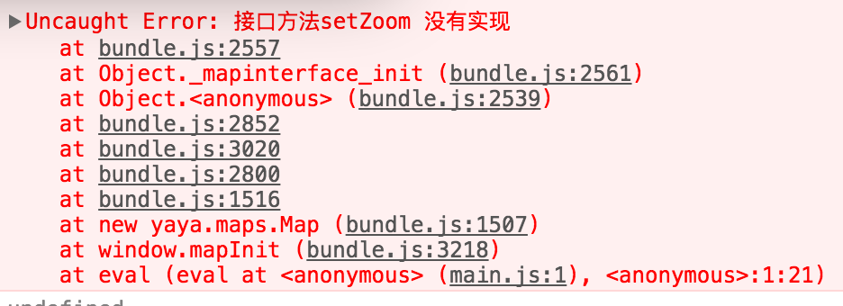

最近在开发地图页面的时候，有个需求是国内使用腾讯地图，国外使用谷歌地图。做这个需的时候就想封装一下地图sdk，使之对业务逻辑透明，这样可以复用业务逻辑。想到定义接口(interface或protocol)，谷歌、腾讯地图实现(implement)一下具体的操作就可以了。  
 *注:javascript本身是轻巧的弱类型动态语言，不太鼓励引入接口(Interface)这个特性。该不该在js中使用接口这个问题，网上不少讨论。毕竟现在用js来写的项目毕竟以前大很多了，这次还是尝试下在项目中使用接口来规范方法定义。*  

在JavaScript中使用接口，我想到实现的方式大体可以归为两类，一种是运行时检查，一种是编译(打包)时检查：
* *运行前检查:* 通过约定的格式书写代码，在编译(打包)的时候通过打包工具来检查是否通过实现了接口。
  * 好处 ： 减小运行时的额外开销，减小代码体积，还能提前报错。
  * 缺点 ： 要编写相应的检测逻辑(或者测试用例)或者代码分析器，覆盖可能不全。
* *运行时检查:* 执行脚本时，在生成对象的时候，通过置于脚本中的逻辑来判断是否实现了接口，没有的话则抛出异常。
  * 优点 :  实现比较简单，简单的编写一次就可以重复用了。
  * 缺点 :  会有些额外开销，执行到的时候才能报错。

因为性能影响不明显，就怎么简单怎么来了，这次就研究在运行时检查的方法。
      
## 实现思路
模拟接口的目的本来就是为了利于开发，所以实现起来就要整洁好看点。然后，才是开销少点吧。  
* 我首先想到可以利用ES6类定义的extends来模拟，自己模拟一个虚基类，然后继承虚基类。C++也是可以通过继承虚基类来达成使用接口的特性的目的；不过C++是支持多继承的，js是不支持这种变态的设计的。js不能多继承，如果继承了虚基类(模拟的接口)，就不能继承父类了。怎么办呢？  
好在有js的动态特性，可以直接构造出一个父类出来，大概可以是下面两种写法：  

```
  class MyClass extends interface(superclass,face1,face2,face3){}

  class MyClass extends interface(superclass,[face1,face2,face3]){}  

```

这样写就比较像接口的语法了，其中 interface 函数做的作用就是返回一个继承了 superclass 的类,faceN为要实现的接口。interface方法要检查 MyClass 这个类是否实现了接口中定义的方法;以及，在原型的特定对象中记录下该类实现的接口列表，用于使用对象时判断该对象实现的接口类型。  
* 具体在我做的这个项目中，没有按上面的来做，简单的做了个实现。因为涉及到两个地图操作的封装和切换，所以用了委托代理模式，把相关操作分别委托给两个实现了接口的对象。我的书写方式大致像下面:

```
class MyClass extends mapinterface(mapbase,options.type=='qq'?mapqq:mapgoogle) {}

```
        
## 主要代码
下面是我在interface中用于实现查询是否的主要代码：
```
//checkImp
let mapinterface = ( superclass, implement ) => class extends superclass {
    constructor (options) {
        super(options);
        //checkImp
        (()=>{
            var imp = implement.prototype;
            var memberList = Object.getOwnPropertyNames(mapinterface(Object,'check').prototype);
            for (var key in memberList){
                var mothed = memberList[key];
                if (typeof imp[mothed] !== 'function'){   
                    throw new Error('接口方法' + mothed + ' 没有实现');
                }
            }
        })();

        this._mapImplement = new implement;
        var implementName = implement.prototype.constructor.name;
        this._mapImplements[implementName] = this._mapImplement; 

    }
    //下面是接口列表
    removeListener (listener) {
        this._mapImplement.removeListener.apply(this,arguments);
    }

    .....

}

```
*注释:因为class定义的方法是不可枚举的，所以用了getOwnPropertyNames方法。*

运行的效果如下:

  

## 结尾
除了上面的思路，还是有很多其他更好的办法的，比如直接给已经实例化好的对象直接添加接口类型和实现，js还是灵活。
实现可能有点蠢，等有时间慢慢琢磨下，应该还能做不少改进。